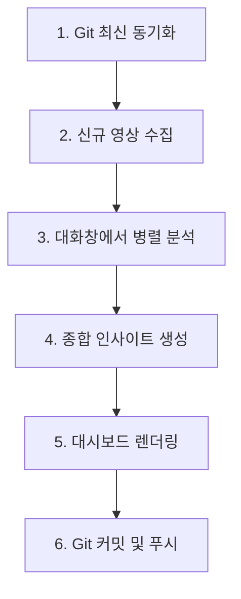

# YouTube Insight - 대화형 에이전트 기반 분석 워크플로우 가이드

본 문서는 회사 노트북, 개인용 데스크톱 등 **여러 기기(컴퓨터)에서 별도의 Gemini API Key 설정 없이** 대화창의 AI 에이전트(Antigravity)와 병렬 서브에이전트를 활용하여 유튜브 영상 분석 및 대시보드 갱신 작업을 동일하고 일관되게 수행할 수 있도록 안내하는 가이드라인입니다.

---

## 1. 다중 기기 간 동기화의 핵심 (Git & GitHub)

모든 작업 내용(소스코드, 분석된 JSON, 종합 인사이트, 빌드된 HTML 파일)은 **GitHub 원격 저장소**를 통해 동기화됩니다.
* **작업 시작 전**: 항상 최신 상태를 당겨옵니다. (`git pull`)
* **작업 완료 후**: 항상 변경 사항을 원격에 올려둡니다. (`git push`)

---

## 2. 전체 분석 및 빌드 워크플로우 (6단계)

Gemini API Key가 로컬에 없을 때, 다음 6단계 프로세스를 대화창의 에이전트에게 순서대로 요청하여 진행합니다.

### [Step 1] 최신 데이터 동기화 (Git Pull)
어느 컴퓨터에서든 작업을 시작하기 전 대화창에 아래와 같이 요청합니다.
* **에이전트 요청 예시**: `"헤이 깃허브에서 최신 소스 당겨와줘 (git pull)"`

### [Step 2] 신규 영상 수집 (Collect Pending)
채널 설정(`config/channels.json`)에 맞춰 새로운 영상 목록과 자막 데이터를 로컬에 수집합니다. 이 과정은 API Key가 없어도 작동합니다.
* **에이전트 요청 예시**: `"신규 영상을 수집해줘 (python main.py --collect 실행)"`
* **결과**: `data/pending/` 디렉토리에 미분석 영상 자막 JSON 파일들이 생성됩니다.

### [Step 3] 대화창을 이용한 병렬 분석 (Parallel Analysis)
로컬에 API Key가 없으므로, **대화창의 AI 에이전트의 LLM 컨텍스트**를 활용하여 분석을 수행합니다. 영상이 많을 경우 타임아웃을 방지하기 위해 에이전트가 스스로 병렬 서브에이전트(Batch)를 띄워 처리합니다.
* **에이전트 요청 예시**: `"data/pending 폴더에 쌓인 미분석 영상들을 병렬 서브에이전트로 나누어서 분석하고 분류해줘. 스타일 가이드에 맞게 HTML 하이라이트 태그도 추가해줘."`
* **결과**:
  * `data/analyzed/{주제ID}/{영상ID}.json`으로 분석 데이터가 자동 저장됩니다.
  * 분석이 끝난 파일은 `data/pending/`에서 제거됩니다.
  * 기존의 종합 인사이트 캐시 파일(`data/synthesis/{주제ID}.json`)이 자동으로 제거되어 갱신 대상으로 지정됩니다.

### [Step 4] 종합 인사이트(Synthesis) 직접 생성
로컬 API Key가 없으면 `main.py --render` 명령 실행 시 종합 인사이트 생성이 스킵됩니다. 따라서 **대화창의 에이전트에게 각 토픽의 분석본들을 읽고 종합 인사이트 JSON 파일을 직접 작성해달라고 요청**해야 합니다.
* **에이전트 요청 예시**: `"최근 분석본들을 바탕으로 각 토픽의 종합 인사이트 파일을 생성해줘. 데이터 저장 경로는 data/synthesis/ 아래에 각 토픽 ID(robot, economy, tech, stock, space, etc)별 json 파일로 작성해줘."`
* **결과**: `data/synthesis/{주제ID}.json` 파일들이 생성됩니다. (수동 편집본을 유지하고 싶었던 `economy.json`도 사용자의 의사에 따라 동적으로 갱신됩니다)

### [Step 5] 대시보드 빌드 (Render Dashboard)
대시보드 HTML 파일을 생성합니다.
* **에이전트 요청 예시**: `"대시보드 페이지들을 빌드해줘 (python main.py --render 실행)"`
* **결과**: `output/html/` 경로 아래에 모바일 반응형 대시보드 웹페이지가 생성됩니다.

### [Step 6] 깃허브 배포 및 동기화 (Git Push)
작업이 정상 완료되었음을 확인한 후, 변경사항을 커밋하여 깃허브에 배포(Vercel 연동 등)하고 다른 컴퓨터에서도 이어서 작업할 수 있도록 만듭니다.
* **에이전트 요청 예시**: `"분석 데이터와 빌드 결과물을 깃허브에 푸시해줘 (git add, commit, push)"`

---

## 3. 에이전트 작업 시의 약속 및 주의사항

1. **모바일 뷰 채널 토글 레이아웃 보존**:
   * 모바일 화면에서 채널 정보가 너무 많아 공간을 많이 차지할 경우 이를 숨기고 토글할 수 있는 기능이 `agents/renderer.py`에 적용되어 있습니다. 대시보드를 리팩토링하거나 렌더러를 편집할 때 이 모바일 숨김/토글 기능이 사라지지 않도록 주의해야 합니다.
2. **Economy.json의 처리**:
   * `economy.json` 파일은 과거 사용자의 수동 수정을 위해 보존하는 룰이 있었으나, 사용자의 결정에 따라 현재는 고정하지 않고 **다른 주제들과 동일하게 에이전트 분석을 거쳐 최신 데이터로 동적 갱신(덮어쓰기)**합니다.
3. **서브에이전트 실행 시의 커맨드 예외**:
   * 에이전트 내의 서브에이전트는 터미널 명령을 직접 실행할 때 사용자 권한 승인 대기 등으로 인해 타임아웃이 발생할 수 있습니다. 따라서 빌드(`--render`)나 깃 조작(`git pull/push`) 같은 CLI 명령어는 반드시 **부모 에이전트(대화창을 직접 통제하는 에이전트)**가 처리해야 합니다.
